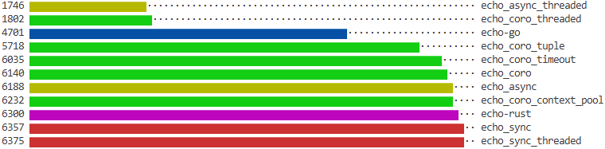
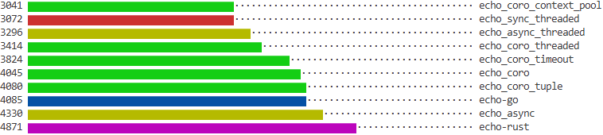

****************************************************************************************************
Benchmarks
****************************************************************************************************

The benchmarks are done with the ``echo_*`` examples servers. The ``client`` connects and sends/receives as much data as possible within **10s**. The result is the average **MiB/s** in that time, over all connections.

Single Connection
*****************

Multiple Connections
********************
The client is run with 10 concurrent connections.

.. note:: There is no **echo_sync** here, as it supports only a single connection.