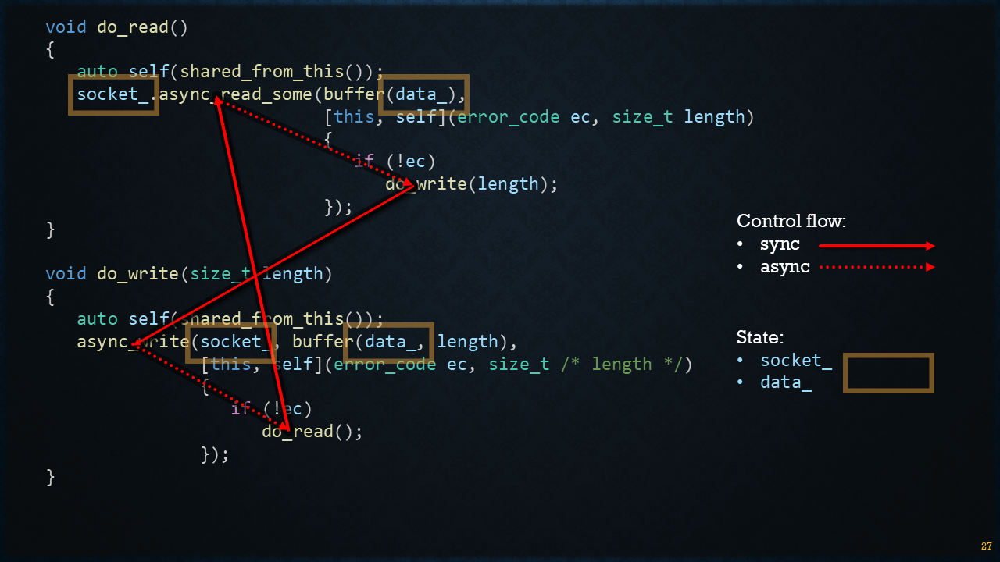

####################################################################################################
Form Sync to Async to As-Sync
####################################################################################################

.. https://www.sphinx-doc.org/en/master/usage/restructuredtext/basics.html#sections

The objective is to implement a simple TCP Echo Server that accepts TCP incoming connections and simply echoes anything that is sent to it.

We start off with a very simple, synchronous implementation and use that to motivate the use of synchronous operations, which is what ASIO is all about.

Finally, we escape callback hell by introducing `C++20 Coroutines`_.

Synchronous
****************************************************************************************************

echo_sync.cpp
=============

Let's start off simple: Introduce the `io_context`_ and `acceptor`_ classes and how to create a simple TCP listening socket accepting incoming connections.

.. https://www.sphinx-doc.org/en/master/usage/restructuredtext/basics.html#hyperlinks
.. _io_context: https://www.boost.org/doc/libs/latest/doc/html/boost_asio/reference/io_context.html
.. _acceptor: https://www.boost.org/doc/libs/latest/doc/html/boost_asio/reference/ip__tcp/acceptor.html
.. _C++20 Coroutines: https://en.cppreference.com/w/cpp/language/coroutines.html

.. code-block:: cpp

   #include <boost/asio.hpp>

   using namespace boost::asio;
   using ip::tcp;

   void session(tcp::socket socket)
   {
      std::array<char, 64 * 1024> data;
      for (;;)
      {
         boost::system::error_code ec;
         std::size_t n = socket.read_some(buffer(data), ec);
         if (ec == error::eof)
            return;
         write(socket, buffer(data, n));
      }
   }

   void server(tcp::acceptor acceptor)
   {
      for (;;)
         session(acceptor.accept());
   }

   int main()
   {
      io_context context;
      server(tcp::acceptor{context, {tcp::v6(), 55555}});
   }

What's wrong here?

.. warning:: This code can handle only one connection at a time!

Synchronous (with threads)
==========================

To solve the problem, we can simply start a new thread for each accepted connection:

.. code-block:: cpp

   void server(tcp::acceptor acceptor)
   {
      for (;;)
         std::thread(session, acceptor.accept()).detach();  // was: session(a.accept());
   }

Now the echo server is capable of handling multiple connections in parallel. A new thread is created for each connection.

.. warning:: Spawning a thread per connection is slow and does not scale!

Asynchronous
****************************************************************************************************

So, spawning a new thread for each connection does not scale. So what can we do instead? Blocking a thread to wait for something to happen is not an option any more.

Enter the world of `Asynchronous Operations`_. Instead of using their *sync* counterparts, we now have `async_accept`_. In the echo loop, it is `async_read_some`_ and `async_write_some`_.

.. _Asynchronous Operations: https://www.boost.org/doc/libs/latest/doc/html/boost_asio/overview/model/async_ops.html
.. _async_accept: https://www.boost.org/doc/libs/latest/doc/html/boost_asio/reference/basic_socket_acceptor/async_accept.html
.. _async_read_some: https://www.boost.org/doc/libs/latest/doc/html/boost_asio/reference/basic_stream_socket/async_read_some.html
.. _async_write_some: https://www.boost.org/doc/libs/latest/doc/html/boost_asio/reference/basic_stream_socket/async_write_some.html

echo_async
==========

main()
------
.. code-block:: cpp

   int main()
   {
      boost::asio::io_context context;
      server server(tcp::acceptor{context, {tcp::v6(), 55555}});
      context.run();
   }

   
Server
------------
.. code-block:: cpp

   class server
   {
   public:
      explicit server(tcp::acceptor acceptor)
         : acceptor_(std::move(acceptor))
      {
         do_accept();
      }

   private:
      void do_accept()
      {
         acceptor_.async_accept([this](error_code ec, tcp::socket socket)
            {
               if (!ec)
                  std::make_shared<session>(std::move(socket))->start();

               do_accept();
            });
      }

      tcp::acceptor acceptor_;
   };

Session
-------
.. code-block:: cpp

   class session : public std::enable_shared_from_this<session>
   {
   public:
      explicit session(tcp::socket socket) : socket_(std::move(socket)) {}
      void start() { do_read(); }

   private:
      void do_read()
      {
         auto self(shared_from_this());
         socket_.async_read_some(buffer(data_),
                                 [this, self](error_code ec, std::size_t length)
                                 {
                                    if (!ec)
                                       do_write(length);
                                 });
      }

      void do_write(std::size_t length)
      {
         auto self(shared_from_this());
         boost::asio::async_write(socket_, buffer(data_, length),
                                 [this, self](error_code ec, std::size_t /* length */)
                                 {
                                    if (!ec)
                                       do_read();
                                 });
      }

      tcp::socket socket_;
      std::array<uint8_t, 64 * 1024> data_;
   };

The control flow can be visualized like this:

Also note that the session *state* is maintained as class members (``socket_`` and ``data_``).

As-Synchronous (Coroutines)
****************************************************************************************************

Modern implementations using C++20 coroutines (co_await / awaitable) with Asio's
awaitable primitives. Key points:

- Offers sequential-style code while remaining non-blocking.
- Removes much of the boilerplate and state-machine complexity of callbacks.
- Can be run single-threaded or on a multi-threaded io_context.
- Typically uses asio::awaitable and use_awaitable completion token (or similar) provided by the Asio variant used in this project.

.. code-block:: cpp

   #include <boost/asio.hpp>

   using namespace boost::asio;
   using ip::tcp;

   awaitable<void> session(tcp::socket socket)
   {
      std::array<char, 64 * 1024> data;
      for (;;)
      {
         size_t n = co_await socket.async_read_some(buffer(data));
         co_await async_write(socket, buffer(data, n));
      }
   }

   awaitable<void> server(tcp::acceptor a)
   {
      for (;;)
         co_spawn(a.get_executor(), session(co_await a.async_accept()), detached);
   }

   int main()
   {
      io_context context;
      co_spawn(context, server({context, {tcp::v6(), 55555}}), detached);
      context.run();
   }

Notes on choosing an implementation
***********************************
- Start with sync for learning and debugging.
- Use thread-sync or thread pools for moderate concurrency with simpler synchronous code structure.
- Prefer async or coro for high concurrency and lower resource usage.
- Coroutines give clearer, maintainable code compared to callback-based async, at the cost of needing a modern C++ toolchain and coroutine-aware Asio setup.
