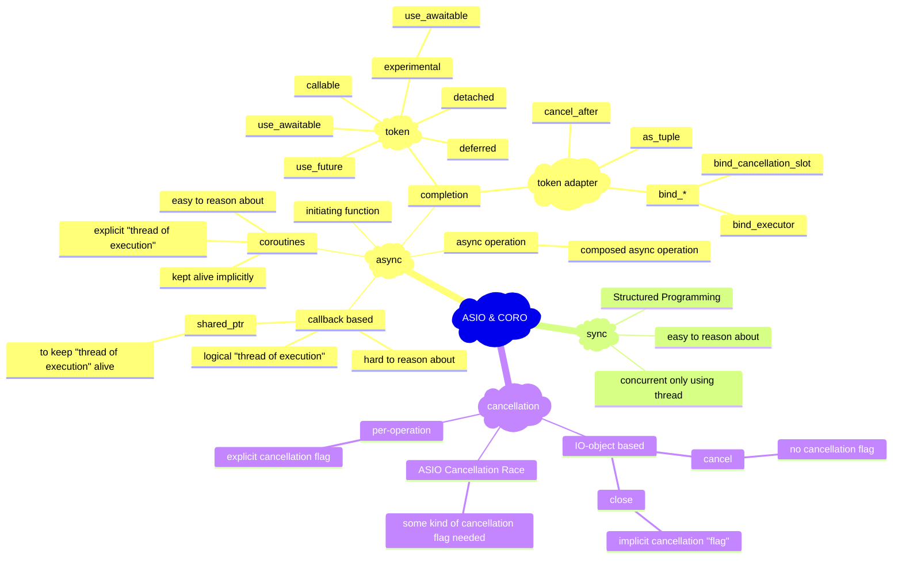

# Mindmap

Try to use Mermaid for creating a mindmap.

```mermaid
---
config:
  layout: tidy-tree
---
mindmap
root)ASIO & CORO(
   )async(      
      callback based
         hard to reason about
         logical "thread of execution"
         shared_ptr
            to keep "thread of execution" alive
      coroutines
         explicit "thread of execution"
         kept alive implicitly
         easy to reason about
      initiating function
      async operation
         composed async operation
      completion
         )token(
            callable
            use_future
            use_awaitable
            deferred
            detached
            experimental
               use_awaitable
         )token adapter(
            as_tuple
            cancel_after
            bind_*
               bind_executor
               bind_cancellation_slot
   )sync(
      easy to reason about
      concurrent only using thread
      Structured Programming
   )cancellation(
      IO-object based
         cancel
            no cancellation flag
         close
            implicit cancellation "flag"
      ASIO Cancellation Race
         some kind of cancellation flag needed
      per-operation
         explicit cancellation flag
```
