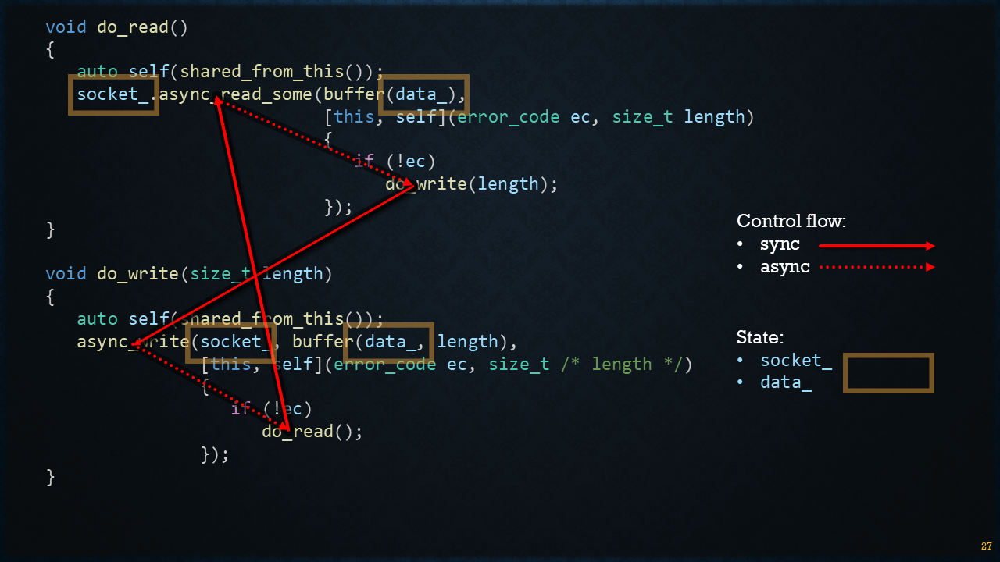

# Sync

Synchronous send and receive calls, once thread per connection.
* [echo_sync.cpp](echo_sync.cpp)
* [echo_sync_threaded.cpp](echo_sync_threaded.cpp)

### Synopsis

```c++
void session(tcp::socket socket)
{
   std::array<char, 64 * 1024> data;
   for (;;)
   {
      boost::system::error_code ec;
      std::size_t n = socket.read_some(buffer(data), ec);
      if (ec == error::eof)
         return;
      write(socket, buffer(data, n));
   }
}
```

# Async

Fully asynchronous implementation in classic ASIO style with callbacks.
* [`echo_async.cpp`](echo_async.cpp)

### Synopsis

Pasted as an image to illustrate the complicated control flow.



# As-Sync

Implementation with coroutines in similar structure as synchronous version, hence the term *as-sync*.

* [`echo_coro_tuple.cpp`](echo_coro_tuple.cpp)
* [`echo_coro.cpp`](echo_coro.cpp)

```c++
awaitable<void> session(tcp::socket socket)
{
   std::array<char, 64 * 1024> data;
   for (;;)
   {
      size_t n = co_await socket.async_read_some(buffer(data));
      co_await async_write(socket, buffer(data, n));
   }
}
```
